# Tofas Spare Parts Website

This project is a spare parts e-commerce website developed with **Angular 17** for the frontend and **.NET Core 8** for the backend. Users can easily view car brands, models, and spare parts, add them to their cart, and place orders. The admin panel allows management of users, parts, and complaints.

**PostgreSQL** is used as the database. Tables were created with SQL scripts, and the data was automatically scraped from the web using the **Python Selenium** library.

## Project Features

- Modern and user-friendly interface
- List of car brands and models
- Spare part search and filtering
- Cart and checkout operations
- User registration/login/password reset
- Admin panel (user, part, complaint management)

## Screenshots

Some screenshots from the project are shown below:

Admin Panel

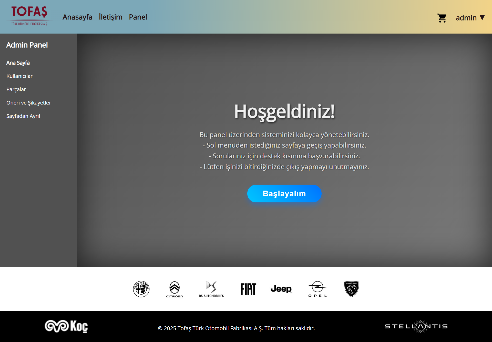
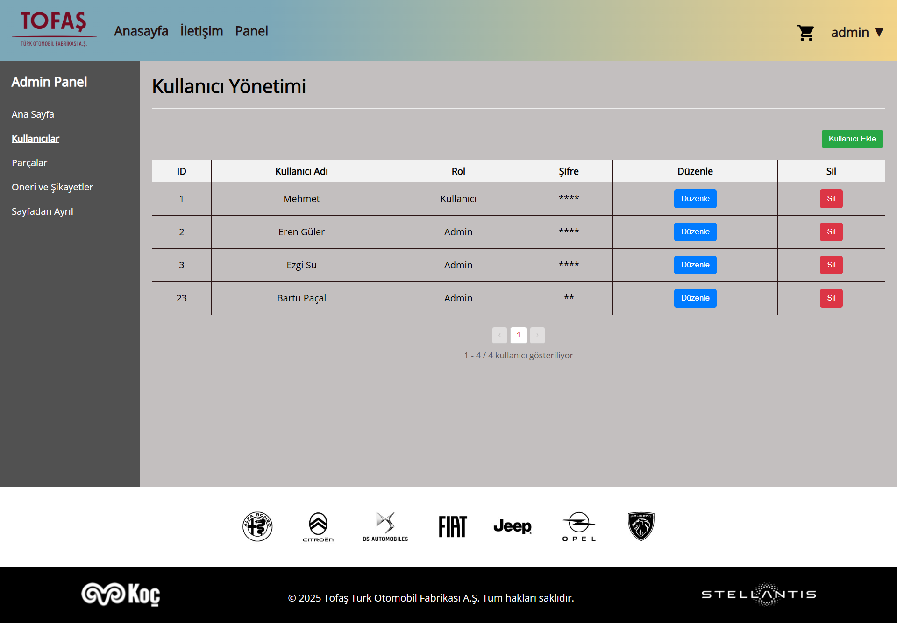
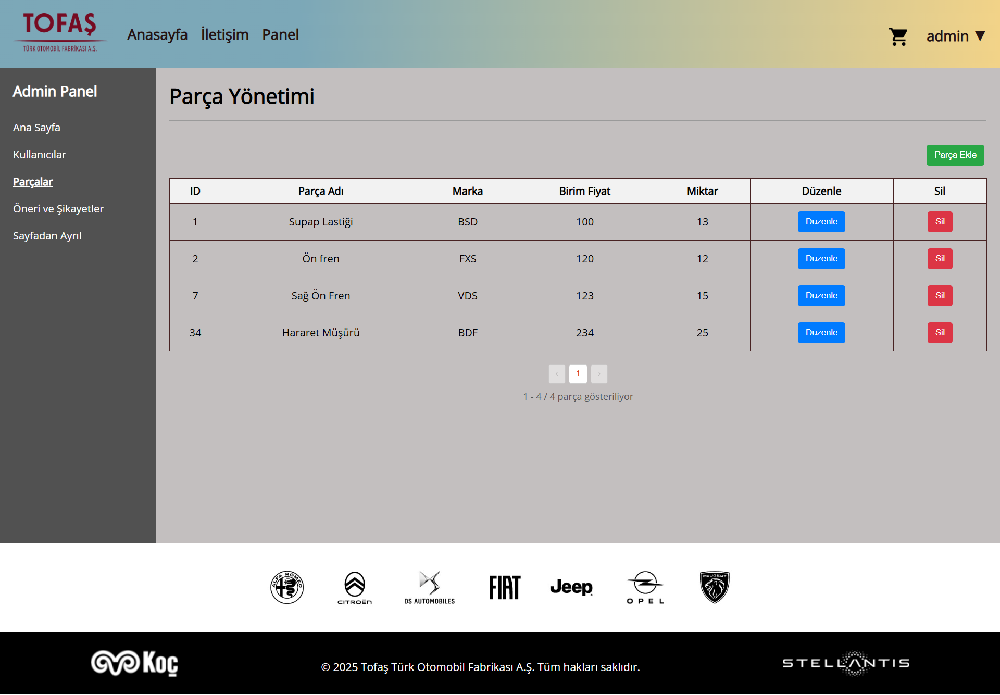
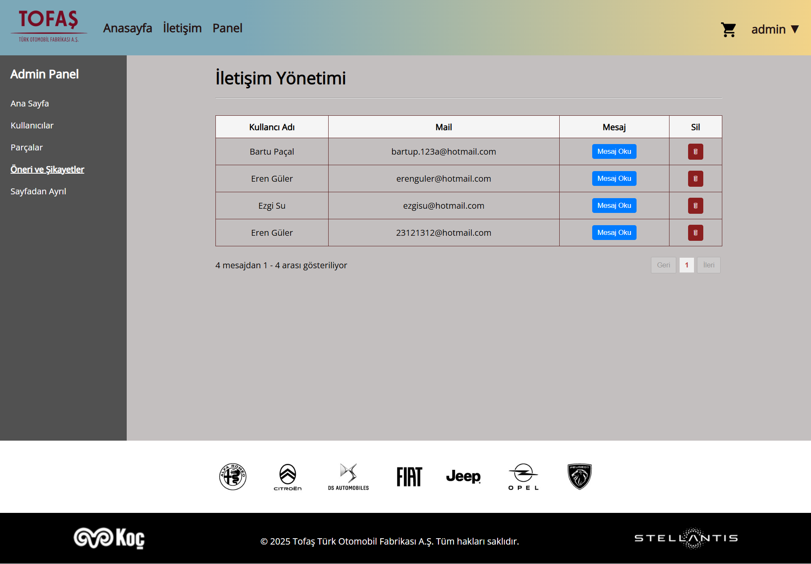

User Panel

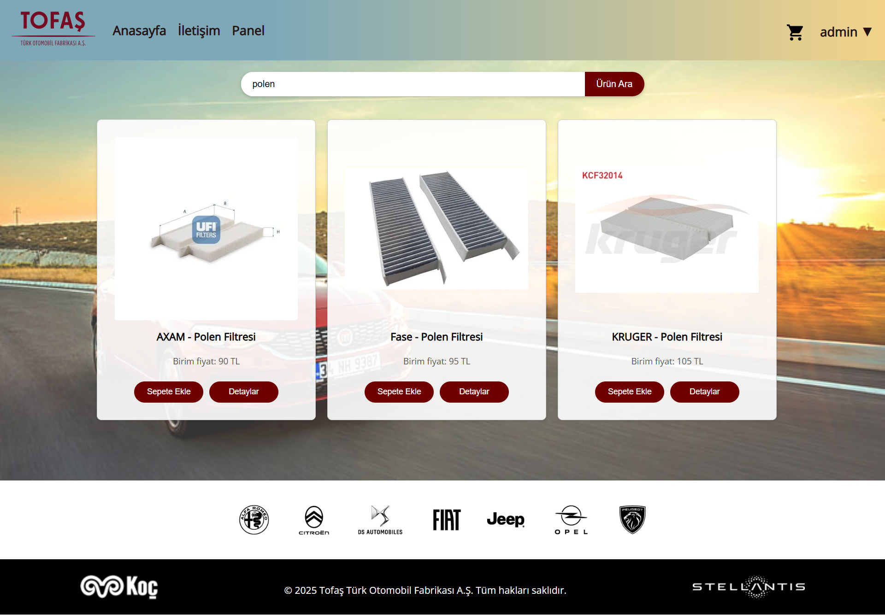
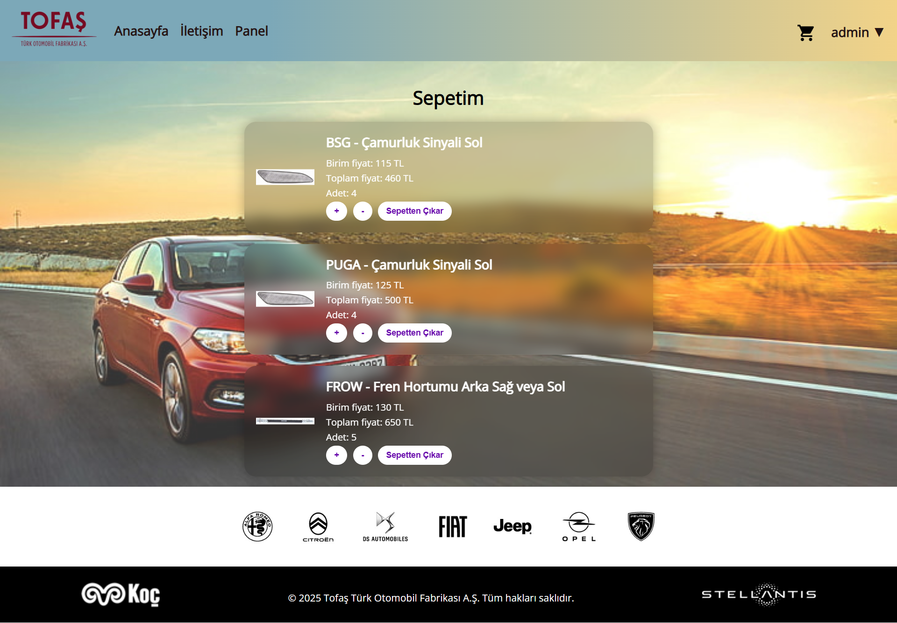
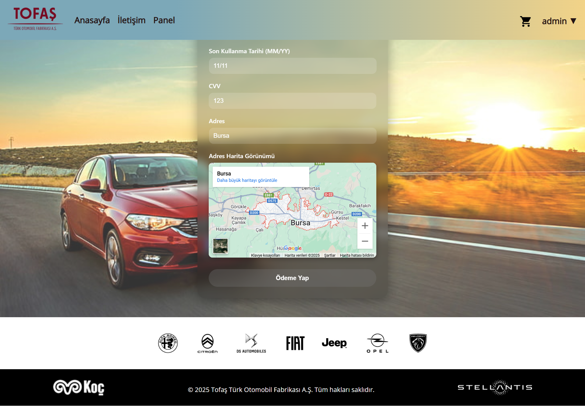

Login/Register/Password Reset

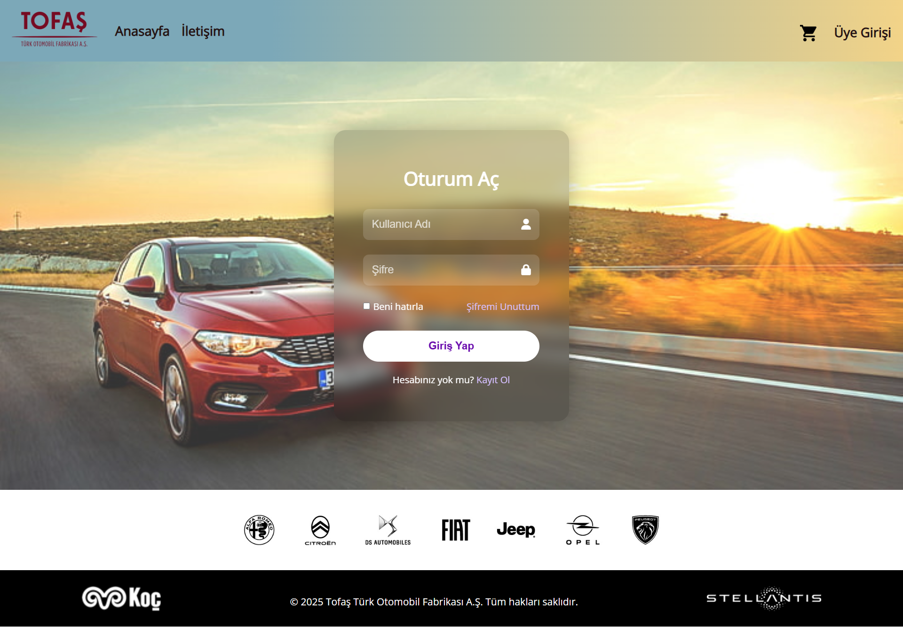
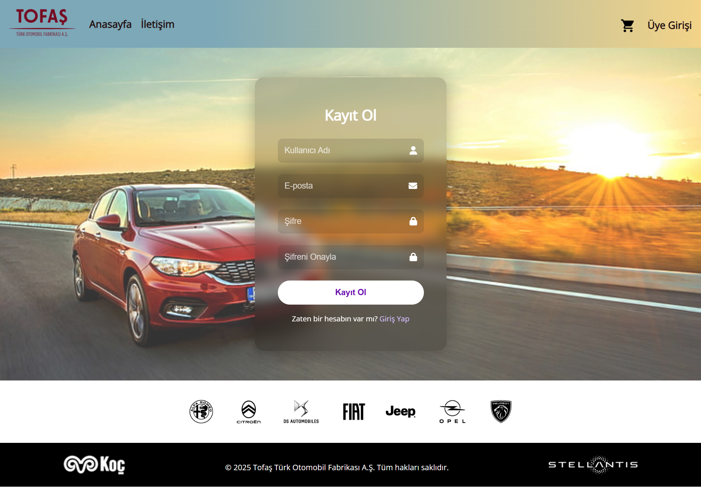
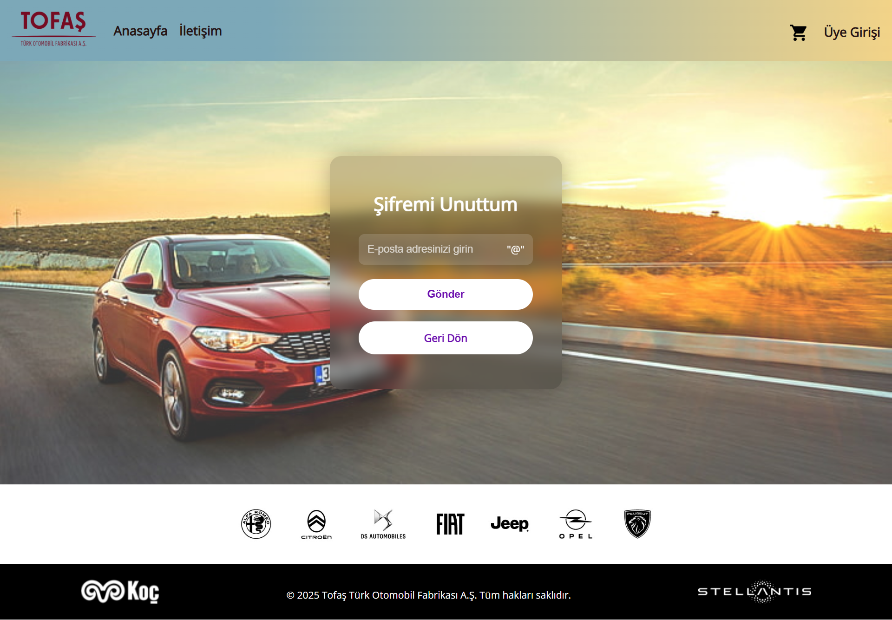

API & Swagger

The backend provides a RESTful API for all operations (user, part, complaint, etc.).
Swagger UI is used for interactive API documentation and testing. You can view all endpoints, send requests, and see responses directly from the browser.

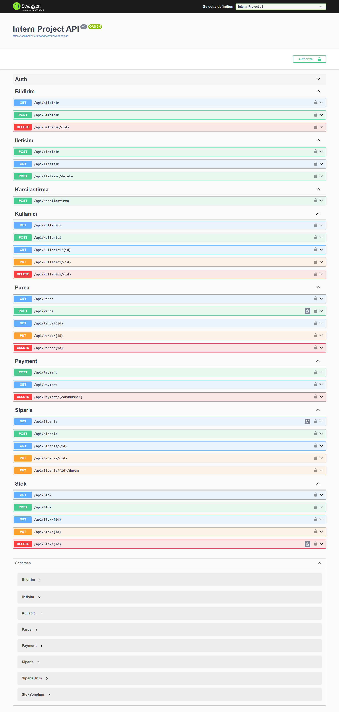
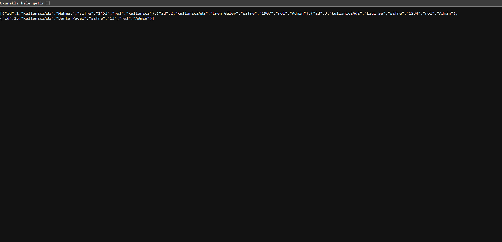
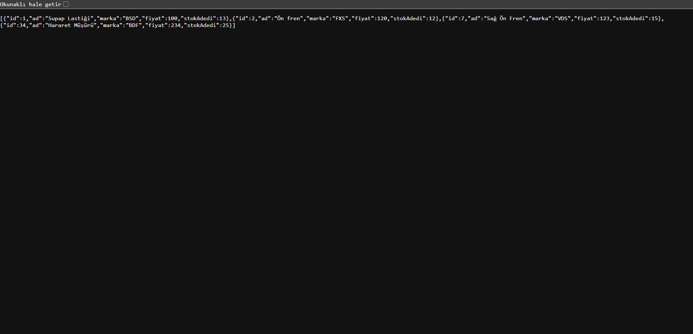
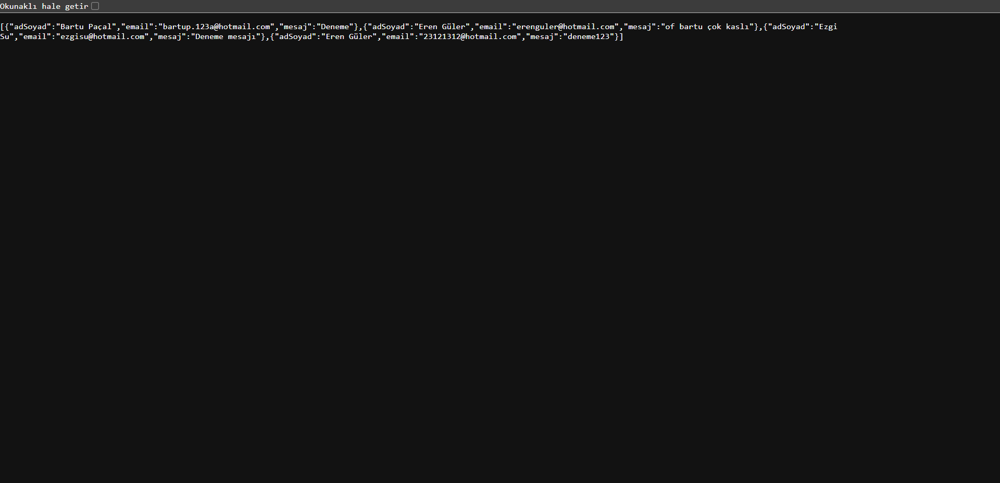

You can find all screenshots in the `web-images` folder.

---

## Getting Started

To run the project locally, make sure you have Node.js, Angular CLI, .NET 8 SDK, PostgreSQL, and Python installed. Clone the repository and follow the instructions below.

### Frontend

- Navigate to the `Frontend/carsite` directory.
- Run `npm install` to install dependencies.
- Start the Angular app with `ng serve`.

### Backend

- Navigate to the `Backend` directory.
- Restore .NET dependencies and run the project with `dotnet run`.

### Database

- Use the SQL scripts in the `Database` folder to create tables and insert initial data into your PostgreSQL instance.

### Data Collection

- The `script-for-front-images&links/otoosan.py` script uses Selenium to scrape car part data and images from the web. Make sure you have the required Python packages installed before running it.

---

## Folder Structure

- `Frontend/` -Angular 17 frontend application
- `Backend/` -.NET Core 8 backend API
- `Database/` -SQL scripts for PostgreSQL tables and data
- `script-for-front-images&links/` -Python scripts for data scraping
- `web-images/` -Screenshots and images from the project

---
